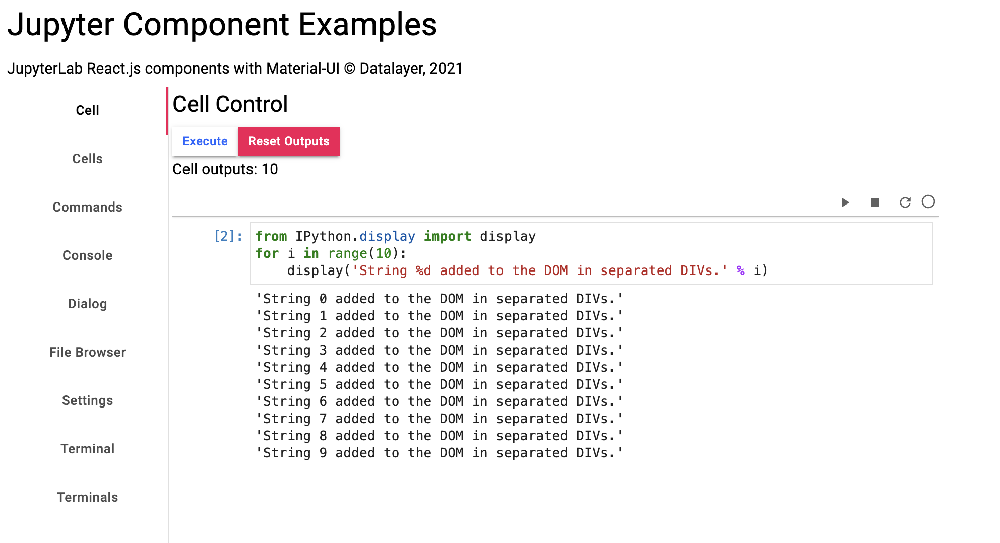

[](https://datalayer.io)

# Jupyter React Example

This repository contains a simple example that uses [Juypyter React](https://docs.datalayer.io/docs/jupyter/react) widgets to create a custom user interface for data analysis.



To setup your environment, ensure you have [miniconda](https://docs.conda.io/en/latest/miniconda.html) and [docker](https://docs.docker.com/get-docker) installed on your local environment.

Then run the following instructions to start a local server.

```bash
# Bootstrap your development environment.
conda deactivate && \
  make env-rm # If you want to reset your env.
make env && \
  conda activate jupyter-react-example
```

```bash
# Install the npm dependencies.
make install
# Build the source.
make build
```

```bash
# Pull the docker image needed to run the Jupyter server.
make docker-pull
# Start the Jupyter server
make docker-start
```

```bash
# Start the local development web server.
echo open http://localhost:8080
make start
```

Enjoy the widgets on http://localhost:8080.

```bash
# Teardown.
make docker-rm
```
